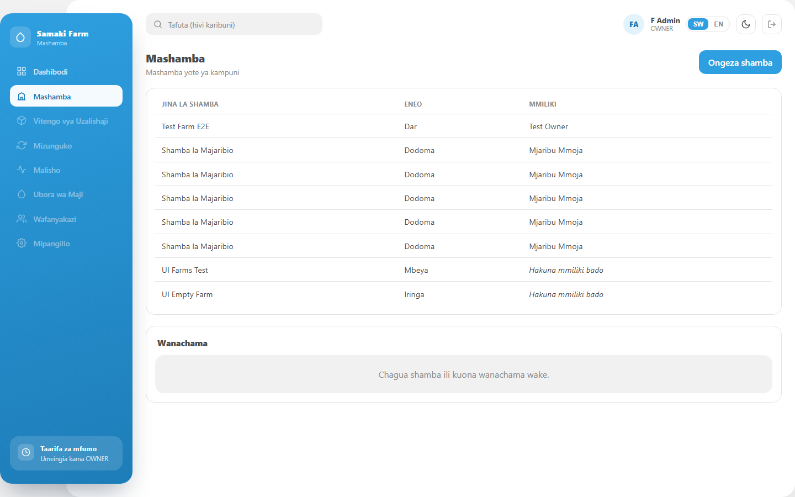
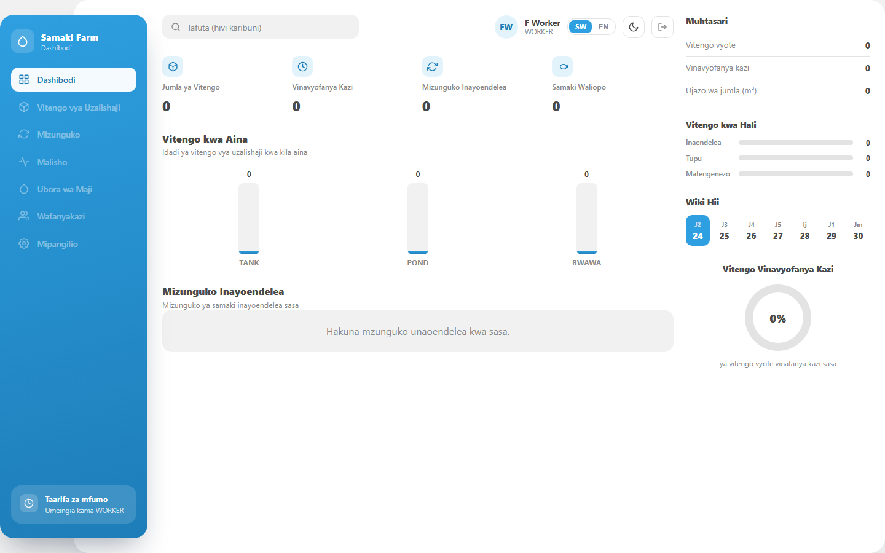
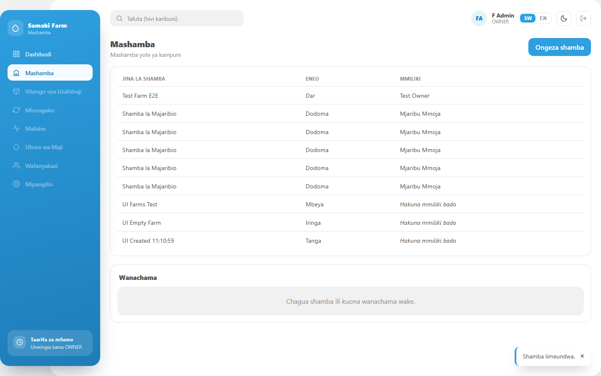
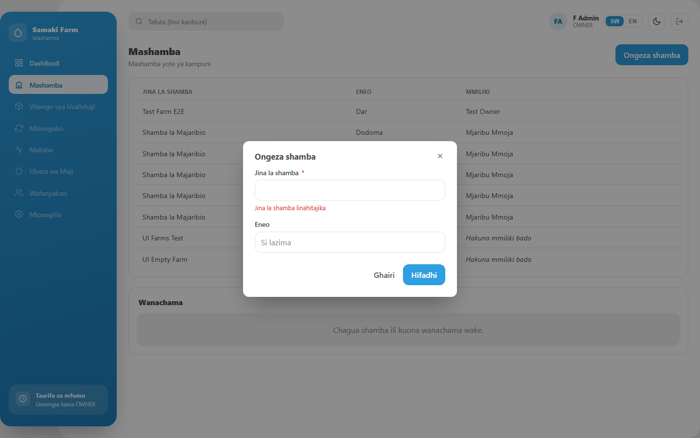
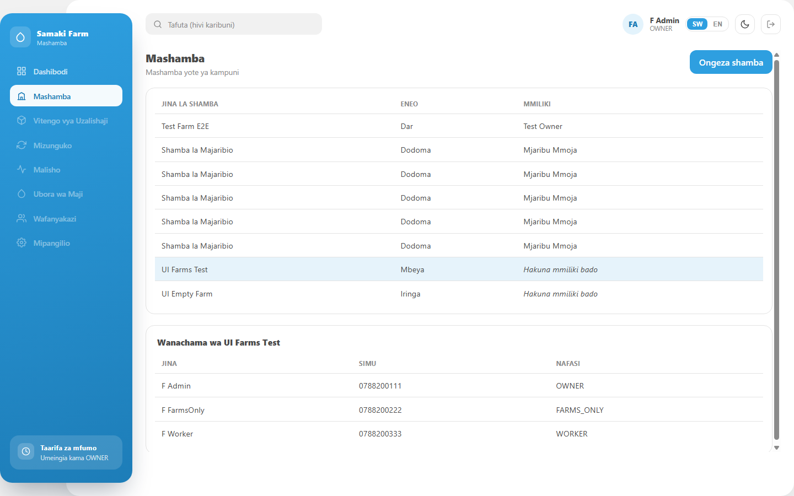
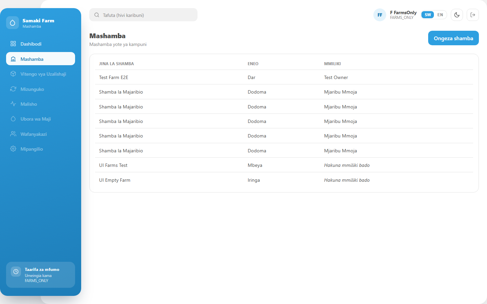
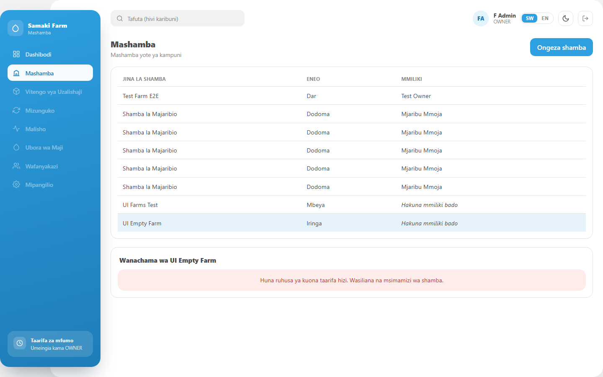
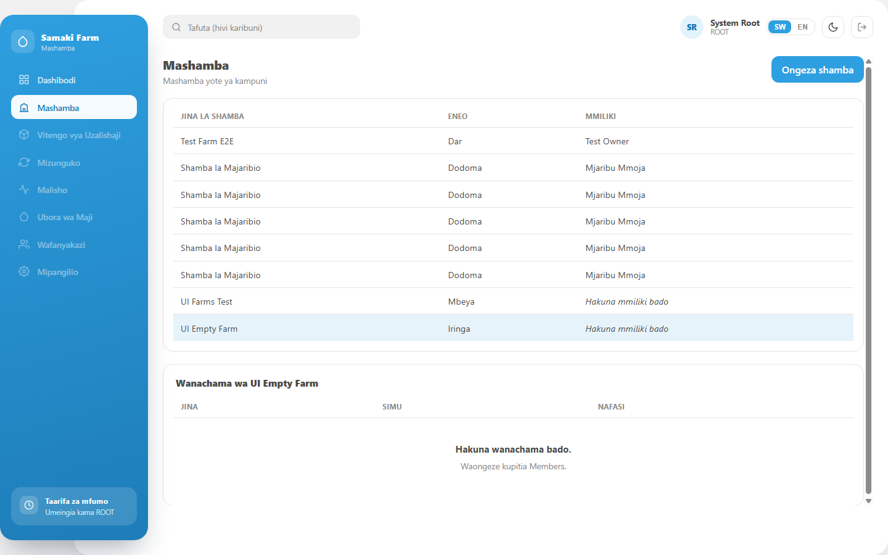

# Farms (Admin) — the first permission-gated screen

**Date:** 2026-08-24
**Repo:** `D:\KAMPUNI PROJECT\samakiFarmFront` — Angular 21
**Branch:** `feat/farms-admin-screen` (from `fix/d4-graphql-error-handling` @ `e20615c`)
**Verified against:** the real backend on `http://localhost:8082` (`main` @ `87a1fcf`), PostgreSQL `samakiFarm`, and the app itself in a real headless Chrome on `http://localhost:4200`

---

## Commits

| # | Commit | What |
|---|---|---|
| 1 | `f9ec04b` | `feat(auth): learn what the user may do from GET /api/auth/me` |
| 2 | `11c751b` | `feat(rbac): reusable permission gating — permissionGuard + *appHasPermission` |
| 3 | `2a2cece` | `refactor(layout): lift the dashboard chrome into a shared AppShell` |
| 4 | `c4fefa7` | `feat(farms): the Farms admin screen, gated on manage_farms` |

### The foundation (reused by Approvals, Members, Roles)

| File | |
|---|---|
| `core/models/permissions.ts` | **new** — the permission codes, one catalogue |
| `core/services/auth.ts` | `permissions` signal + `hasPermission()` + `loadMe()` + `ensurePermissions()` |
| `core/guards/auth-guard.ts` | **`permissionGuard(code)`**, sharing `sessionRedirect()` with `authGuard` |
| `shared/directives/has-permission.ts` | **new** — `*appHasPermission="code"` |
| `shared/layout/app-shell/` | **new** — sidebar, gated nav, topbar; screens project their content |
| `shared/ui/modal/`, `shared/ui/data-table/` | **new** — the two pieces this screen needed |
| `core/http/rest-error.ts` | **new** — REST failures become the same `ApiError` GraphQL ones already were |
| `core/services/farms.ts`, `core/services/users.ts` | **new** — the three endpoints |

---

## Backend verified live BEFORE the screen was built

All three endpoints had never been called from a UI. D-13 was a permanent 500 hiding in exactly that kind of endpoint, so each was exercised with `curl` first.

```
GET  /api/farms                      (ROOT)              → 200, 6 farms
POST /api/farms {"name":"UI Farms Test","location":"Mbeya"}
                                                          → 200 {"farmId":17,…,"ownerName":null}
POST /api/farms {"name":"","location":"Mbeya"}            → 400 {"message":"name: Jina la shamba linahitajika",
                                                                 "errorCode":"VALIDATION_ERROR"}
GET  /api/users?farmId=19            (manage_users)       → 200, 3 members
GET  /api/users?farmId=19            (no manage_users)    → 403 FORBIDDEN
GET  /api/farms                      (no manage_farms)    → 403 FORBIDDEN
```

### Two findings that changed the screen

**1. `farms.name` has no unique constraint — duplicates are accepted.**

```
POST /api/farms {"name":"UI Farms Test",…}   → 200 {"farmId":17,…}
POST /api/farms {"name":"UI Farms Test",…}   → 200 {"farmId":18,…}   ← same name, accepted
```

`\d farms` confirms it: no unique index on `name`, and `FarmService.create` does no lookup. So **the brief's "duplicate → CONFLICT" cannot happen today**. The CONFLICT branch is wired anyway (with the copy the brief asked for) because CONFLICT is part of the shared error vocabulary and this is the endpoint that would raise it the moment that constraint is added — but nothing in the UI can trigger it right now. **Backend decision needed:** should `farms.name` be unique?

**2. `GET /api/users?farmId=` is farm-scoped, while `GET /api/farms` is not.**

```
GET /api/users?farmId=1   (F Admin, manage_users, member of farm 19)
  → 403 {"message":"Huruhusiwi kufikia shamba hili.","errorCode":"FORBIDDEN"}
GET /api/users?farmId=1   (ROOT)
  → 200, 1 member
```

The farms list is deliberately cross-farm; the members endpoint deliberately is not (`requireSameFarm`, with a ROOT bypass). A non-ROOT admin can therefore select any farm but only read the members of their **own**. The panel shows that refusal rather than an empty table — an empty table would say "this farm has nobody on it", which is a different and wrong statement. **This will matter more for the Members screen**, where the whole point is managing people across farms.

### Test principals (created through the real API, removed afterwards)

| Principal | Phone | Role | Permissions |
|---|---|---|---|
| **F Admin** | `0788200111` | OWNER | includes `manage_farms` **and** `manage_users` |
| **F FarmsOnly** | `0788200222` | FARMS_ONLY *(role created for this)* | `manage_farms`, `view_dashboard` — **no** `manage_users` |
| **F Worker** | `0788200333` | WORKER | `log_feeding`, `mark_task_done`, `view_dashboard` — **no** `manage_farms` |

`FARMS_ONLY` was created through `POST /api/roles` precisely to separate the screen's gate from the panel's.

---

## Acceptance

Evidence is a real browser (headless Chrome over CDP) driving the real app against the real backend: a real session in `localStorage`, real network calls. Each item prints the live DOM and a screenshot. Alongside it, **56 unit tests** (`npx ng test`) replay the captured payloads.

### 1. With and without `manage_farms` · **PASS**

**With** (F Admin) — nav shows Mashamba, the route opens:

```
url  : /farms
perms: [approve_users, edit_cycle, log_feeding, manage_farms, manage_feed_stock,
        manage_units, manage_users, mark_task_done, view_dashboard, view_finance]
nav  : [Dashibodi, Mashamba, Vitengo vya Uzalishaji, Mizunguko, Malisho,
        Ubora wa Maji, Wafanyakazi, Mipangilio]
```


**Without** (F Worker) — typed `/farms` directly:

```
url  : /dashboard          ← permissionGuard redirected
perms: [log_feeding, mark_task_done, view_dashboard]
nav  : [Dashibodi, Vitengo vya Uzalishaji, …]      ← no "Mashamba" at all
```


Both permission sets came from `GET /api/auth/me` and are what the app stored.

### 2. `GET /api/farms` renders · **PASS**

Eight rows, matching the database exactly, with `ownerName: null` rendered as **"Hakuna mmiliki bado"** (muted italic) rather than blank:

```
Test Farm E2E       | Dar    | Test Owner
Shamba la Majaribio | Dodoma | Mjaribu Mmoja      (×5)
UI Farms Test       | Mbeya  | Hakuna mmiliki bado
UI Empty Farm       | Iringa | Hakuna mmiliki bado
```

### 3. `POST /api/farms` end to end · **PASS**

Created from the modal, live:

```
open "Ongeza shamba" → type "UI Created 11:10:59" + "Tanga" → Hifadhi
rows 8 → 9,  toast: "Shamba limeundwa."
new row: UI Created 11:10:59 | Tanga | Hakuna mmiliki bado
```


The list is **re-read** after a create rather than patched locally, so the screen shows what the backend actually holds.

**Typed `errorCode`, not a generic failure** — a name of only whitespace passes the client-side `required` check and reaches the backend as `""`, so this is the server's own answer:

```
POST → 400 {"message":"name: Jina la shamba linahitajika","errorCode":"VALIDATION_ERROR"}
UI   → the "Jina la shamba" field shows "Jina la shamba linahitajika", modal stays open
```


The backend names the field, so the message goes **on that field** rather than in a banner. CONFLICT maps to "Shamba lenye jina hili tayari lipo." (unit-tested; see finding 1 for why the live backend cannot produce it).

### 4. Members panel, gated on `manage_users` · **PASS**

**With `manage_users`** (F Admin), selecting *UI Farms Test*:

```
GET /api/users?farmId=19 → 200
F Admin     | 0788200111 | OWNER
F FarmsOnly | 0788200222 | FARMS_ONLY
F Worker    | 0788200333 | WORKER
```


**Without it** (F FarmsOnly) — the farms list is identical, and the panel is **not in the DOM**:

```
perms       : [manage_farms, view_dashboard]
farmRows    : 8 rows, same as the admin sees
membersPanel: false          ← not disabled, not empty: absent
```


**Another farm** (F Admin selecting *UI Empty Farm*, which belongs to nobody) — the farm-scoping from finding 2:

```
GET /api/users?farmId=20 → 403 FORBIDDEN
panel: "Huna ruhusa ya kuona taarifa hizi. Wasiliana na msimamizi wa shamba."
```


### 5. An empty farm shows the empty state · **PASS**

Because of finding 2 this is only reachable as **ROOT** — a farm the caller belongs to is never empty, and any other farm answers FORBIDDEN. As ROOT, selecting the freshly created *UI Empty Farm*:

```
GET /api/users?farmId=20 → 200 {"data":[]}
panel: "Hakuna wanachama bado."  /  "Waongeze kupitia Members."
```


Table headers still render above it — an empty panel, not a broken one.

### 6. Gating lives in one place · **PASS**

```
$ git grep -n "permissionGuard(\|appHasPermission\|hasPermission(" \
      -- 'src/app/*.ts' 'src/app/**/*.ts' 'src/app/**/*.html' ':(exclude)src/app/**/*.spec.ts'

# the three definitions
src/app/core/services/auth.ts:73:          hasPermission(code: string): boolean {
src/app/core/guards/auth-guard.ts:57:     export function permissionGuard(permission: string): CanActivateFn {
src/app/shared/directives/has-permission.ts:24:  selector: '[appHasPermission]',

# every use in the app - four, one per gate
src/app/app.routes.ts:22:                 canActivate: [permissionGuard(PERMISSION.MANAGE_FARMS)],
src/app/shared/layout/app-shell/app-shell.ts:81: NAV_ITEMS.filter(item => … hasPermission(item.permission))
src/app/farms/farms.html:35:             *appHasPermission="PERMISSION.MANAGE_USERS"
src/app/farms/farms.ts:171:              if (!this.authService.hasPermission(PERMISSION.MANAGE_USERS)) return;
```

All four read `AuthService.permissions`, so a control can never disagree with the route that shows it. The last one is not a fourth mechanism: it stops the screen firing a request it already knows will be refused.

The codes themselves appear nowhere as string literals — only as `PERMISSION.*` from one catalogue.

### Suite

```
$ npx ng test --watch=false      Test Files 8 passed (8)   Tests 56 passed (56)
$ npx ng build                   Application bundle generation complete.
```

---

## The layout refactor, and why

Farms was the second screen to need the sidebar, nav and topbar. The alternative to sharing them was copying them, so the chrome moved into `AppShell` — same markup, same class names, same styles.

The dashboard was verified unchanged by screenshotting it before and after: identical, except for the new gated **Mashamba** entry. The nav entries that lead somewhere are anchors now rather than inert `<span>`s, which is why the stylesheet grows a `text-decoration` reset plus hover/focus states.

---

## Housekeeping — test data created and removed

| Created | Removed |
|---|---|
| Farms 17, 18 (the duplicate-name probe) | ✅ deleted |
| Farm 19 "UI Farms Test", 20 "UI Empty Farm", 21 "UI Created …" | ✅ deleted |
| Role 5 `FARMS_ONLY` + its 2 permission rows | ✅ deleted |
| Users F Admin / F FarmsOnly / F Worker + their 3 memberships | ✅ deleted |

Row counts back to the pre-batch baseline:

```sql
  c |        t
----+------------------
  7 | users        6 | farms      6 | farm_users
  4 | roles       21 | role_permissions
 20 | production_units          0 | cycles
```

All four seeded roles hold exactly what they held before. Not reverted (harmless): the `farms` and `roles` sequences advanced past the deleted rows.

---

## Open

1. **Not merged.** `feat/farms-admin-screen` is 4 commits ahead of `fix/d4-graphql-error-handling`, which is itself 4 ahead of `main`. Nothing pushed.
2. **`farms.name` uniqueness** — a backend decision (finding 1). Until it is made, two farms can share a name and the UI will show both.
3. **Members across farms** (finding 2) — the Members screen needs a view of people on farms the admin does not belong to. Either it is a ROOT-only screen, or `GET /api/users?farmId=` needs to accept a `manage_users` holder acting cross-farm.
4. **Out of scope, untouched:** every member-management action (assign, re-role, disable, remove), approvals, roles, and farm rename/relocate/delete (no backend for those).
